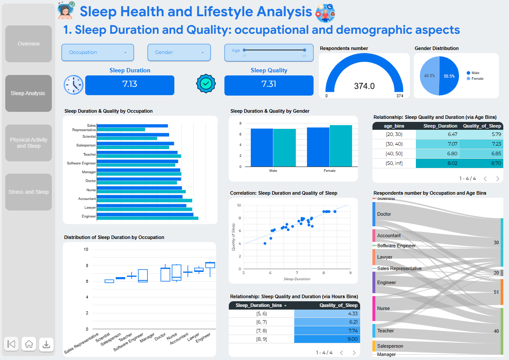

# 💤 Project: Sleep and Lifestyle Impact Analysis

## 🎯 Research Objective

Investigate the relationships between:

* Sleep quality and duration
* Stress levels
* Physical activity
* Daily step count
* Demographic characteristics

---

## 🛠 Tools

* [Google BigQuery](https://www.google.com/url?q=https%3A%2F%2Fconsole.cloud.google.com%2Fbigquery%3Fsq%3D493932026549%3A0e60b33c25da480aa5a97afef77e6ca5)
* [Looker Studio](https://www.google.com/url?q=https%3A%2F%2Flookerstudio.google.com%2Fs%2FhHdzevFRn0Y)
* [Google Colab](https://colab.research.google.com/drive/1e7EoscxcKp_gLGehRkkZ27ww31aOeW0J#scrollTo=DjS_61CpRrZR)

---

## 📈 Analysis Conducted

* Data preparation and cleaning (SQL)
* Calculation of descriptive statistics
* Correlation analysis
* Segmentation by:

  * Age
  * Gender
  * Profession
* Identification of behavioral patterns

---

## 🔎 Key Insights

* Higher stress levels are associated with reduced sleep quality
* Regular physical activity correlates with better recovery metrics
* Certain professions consistently show higher levels of sleep disturbances
* The 30–40 age group exhibits the greatest variability in sleep patterns

---

## 💡 Practical Recommendations

* Personalized suggestions in sleep tracking apps
* Integration of stress monitoring
* User segmentation for targeted advice

---

If you want, I can also **adapt this into a concise “dashboard-friendly” version** with highlights and key metrics for a portfolio or GitHub presentation. Do you want me to do that?
